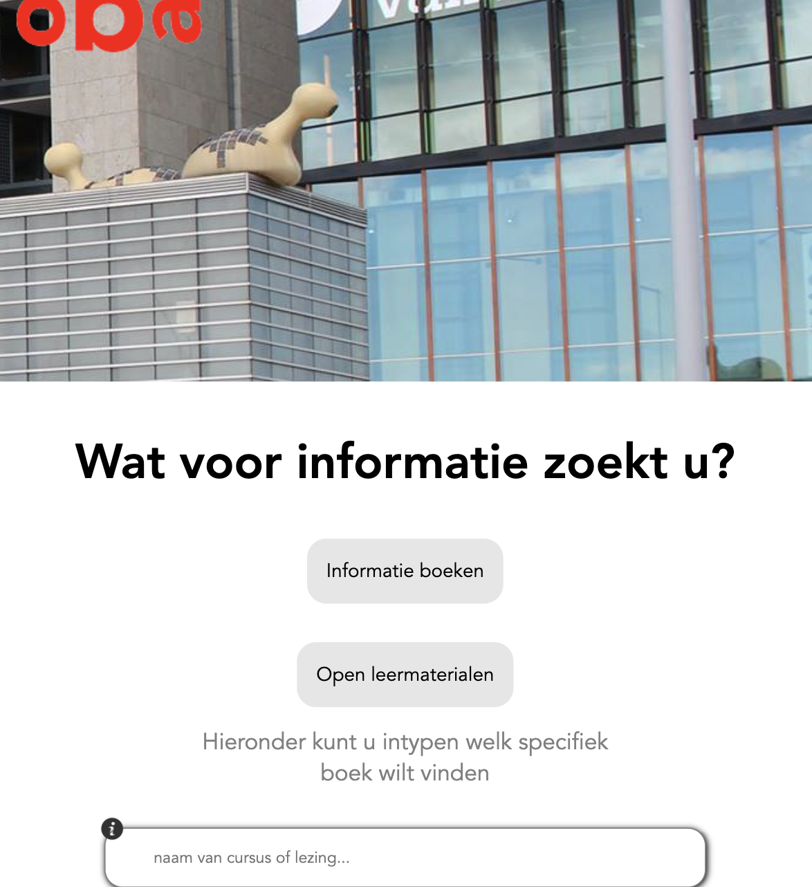

# OBA Senior

Welkom bij mijn project van de minor Webdesign and development. Het doel van dit vak is een single page webapp maken zonder frameworks of libraries.

De website is [hier](https://fabian-vis.github.io/OBA-Senior/ "OBA-Senior") te bekijken.

### User story

> Als een oudere burger wil ik online het aanbod van informatieboeken kunnen bekijken, om zodoende de digitalisering van de maatschappij beter het hoofd te kunnen bieden.

### Wat ga ik maken

Allereerst wilde ik een website maken waarbij ouderen mensen konden zoeken naar cursussen en lezingen. Dit bleek qua data niet helemaal lekker te werken. Ik heb het proces hiervan wel in mijn documentatie gezet die je hier kunt bekijken: [Wiki](https://github.com/fabian-vis/OBA-Senior/wiki "Wiki"). Toen heb ik ervoor gekozen om mijn onderwerp en dus project om te gooien. Ik wil dus een applicatie maken waar oudere mensen gemakkelijk informatieboeken kunt bekijken. Alle belangrijke informatie moet in 1 keer te zien zijn om zo de gebruiker niet in verwarring te brengen. Ook is er een duidelijke call to action naar de reservering van een boek.

### Features

Je kan informatieboeken bekijken die zich binnen de API van de OBA bevinden. Je kan zoeken op een specifiek boek en je kunt filteren op jaren.

### Hoe installeer je dit project op je lokale machine?

1. In je CLI plak deze code: `git clone https://github.com/fabian-vis/OBA-Senior`

2. Cd naar de juiste project folder

3. Open index.html met een liveserver extension

### Activity diagram

### API Documentatie

Ik heb gebruik gemaakt van de OBA API. Deze API is gratis te gebruiken en bevat alle boeken die zich op de OBA bevinden. Ook heb ik gebruikt gemaakt van een experimentele API die open leermateriaal ophaald. Deze API's zijn niet openbaar waardoor een geen online documentatie van is.

### Licence

Dit project is voorzien van een MIT licence.

### Resources

- Docenten en Student-Assistenten

- Medestudenten :)

- Openbare Bibliotheek Amsterdam

- [MDN](https://developer.mozilla.org/en-US/ "MDN")

- [Stackoverflow](https://stackoverflow.com "Stackoverflow")

- [W3Schools](https://www.w3schools.com "W3Schools")
